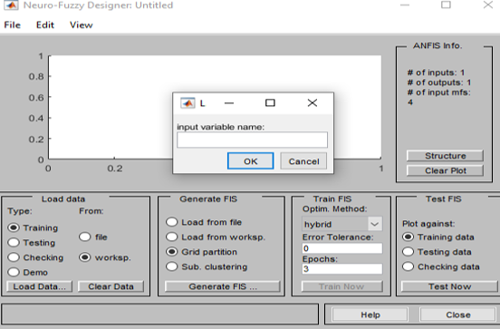
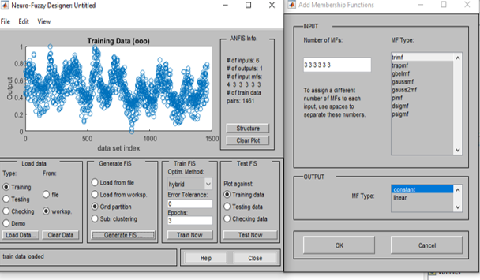
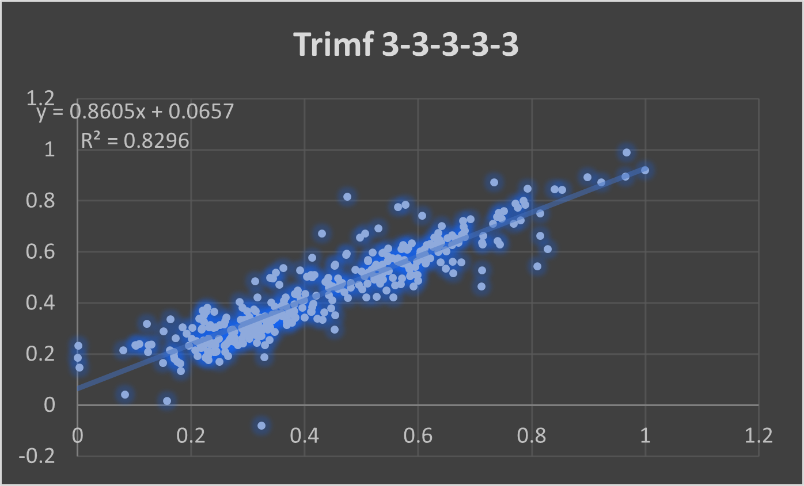
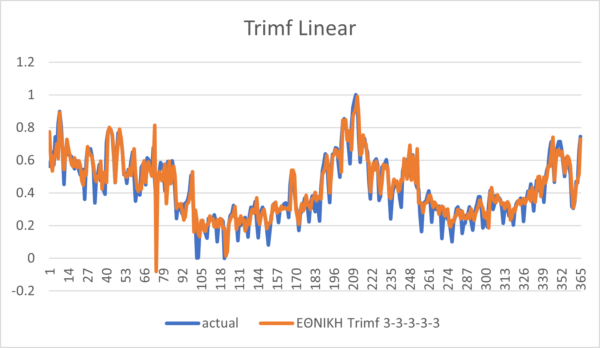
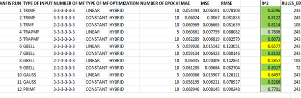

# NaturalGasPrediction
PredictionDescription
# Natural Gas Consumption Forecasting Using ANFIS (MATLAB)

This project presents a fuzzy logic-based approach to forecasting **daily national natural gas consumption** using an **Adaptive Neuro-Fuzzy Inference System (ANFIS)** in MATLAB.

> 🚫 The dataset used in this study is private and **cannot be shared** due to confidentiality agreements. However, all modeling procedures, evaluation methods, and results are shared.

---

## 📊 Project Overview

- **Platform:** MATLAB
- **Model:** ANFIS (Adaptive Neuro-Fuzzy Inference System)
- **Input Features:**
  1. Holiday (binary)
  2. Month (1–12)
  3. Season (1–4)
  4. Gas consumption (2 days ago)
  5. Gas consumption (1 day ago)
- **Output:** Today's gas consumption

> ✅ All features and output were **normalized** before training.

Logic Consept 
1. Step Open Matlab.
2. >> train = [ ] ## creating empty board to add relavant 4 year data
   >> test  = [ ] ## creating empty board to add relavant 5th year data to test our model
   >> testin = [] ## creating empty board to add 5th year data without the output to run our model on one code to get numeric output
3.Model Training
  
  
  
  4. >> anfisedit ## Open ANFIS and  then we are inserting the train data. 
   >> output = evalfis(testin,nationaltrimf.fis) ## Relevant code to get output of our model
---

## 🧠 Modeling Summary

- **Membership Functions Tested:** `trimf`, `trapmf`, `gbellmf`, `gaussmf`, `primf`
- **Best Configuration:** `trimf (3-3-3-3-3)`
- **Optimization Method:** Hybrid (Backpropagation + Least Squares)
- **Epochs:** 10

---

## ✅ Results

### 🔹 Best Model – Trimf 3-3-3-3-3
- **R²:** 0.8296  
- **RMSE:** 0.0781  
- **MAE:** 0.0545  
- **Rules Generated:** 243

### 🔹 Performance Comparison Table

---

---

)
